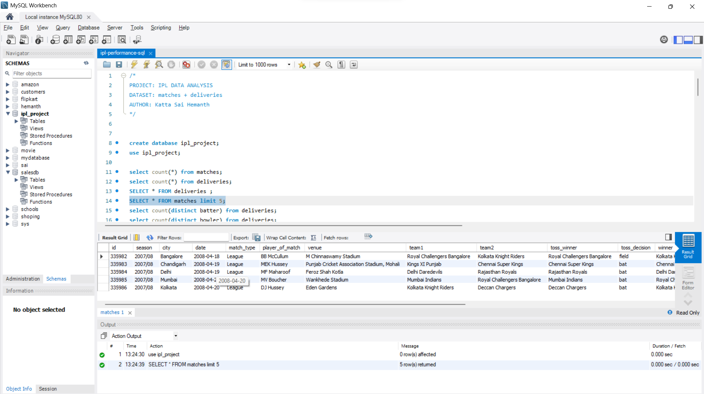

# 🏏 IPL Performance Analysis using SQL

## 📌 Project Overview

This project analyzes **Indian Premier League (IPL)** match and ball-by-ball delivery data using **MySQL**.

The objective is to extract meaningful insights about team performance, player performance, match outcomes, toss impact, batting and bowling statistics, and season-wise trends using SQL.

The project demonstrates practical use of **SQL aggregation, filtering, subqueries, CTEs, CASE statements, JOINs, and window functions**.

---

## 🎯 Objectives

The analysis focuses on answering questions such as:

* Which teams have won the most IPL matches?
* Which players have won the most Player of the Match awards?
* How many matches were played in each season?
* Which venues hosted the most matches?
* Who are the top run-scorers?
* Who are the top wicket-takers?
* Does winning the toss increase the probability of winning the match?
* Which batters perform above the overall average?
* How can batters be categorized based on total runs?
* What are the highest team scores in a single match?
* Who are the top 5 batters in each season?
* How did team wins change compared with the previous season?
* Which teams successfully chased targets above 180 runs?
* Which players have performed strongly in both batting and bowling?

---

## 🗂️ Dataset

The project uses two IPL datasets:

### 1. `matches`

Contains match-level information such as:

* Match ID
* Season
* Teams
* Venue
* Toss winner
* Match winner
* Player of the Match
* Result
* Target runs

### 2. `deliveries`

Contains ball-by-ball information such as:

* Match ID
* Batter
* Bowler
* Batting team
* Batsman runs
* Total runs
* Dismissal type
* Wicket information

---

## 🛠️ Technologies Used

* **MySQL**
* SQL
* CTEs (Common Table Expressions)
* Window Functions
* Aggregate Functions
* Subqueries
* CASE Statements
* JOINs
* GROUP BY / HAVING
* ORDER BY / LIMIT

---

## 📊 Key Analysis

### 🏆 Team Performance

Analyzed the total number of wins for each IPL team and ranked teams based on their overall match victories.

### 👑 Player of the Match Analysis

Identified players who received the **Player of the Match** award three or more times.

### 📅 Season Analysis

Calculated the number of matches played in each IPL season to understand season-wise match distribution.

### 🏟️ Venue Analysis

Identified the top three venues based on the number of IPL matches hosted.

### 🏏 Top Batters

Calculated total runs scored by each batter and identified the top 5 run-scorers.

### 🎯 Top Bowlers

Analyzed dismissals to identify the top wicket-taking bowlers.

### 🪙 Toss Impact

Compared the toss winner with the actual match winner to determine how often teams that won the toss also won the match.

### 📈 Above-Average Batters

Used **CTEs and aggregate functions** to calculate the average total runs across all batters and identify players performing above that average.

### ⭐ Batter Classification

Created performance categories using a `CASE` statement:

* **ELITE** — More than 3000 runs
* **GOOD** — 1000 to 3000 runs
* **DEVELOPING** — Below 1000 runs

### 🔥 Highest Team Score

Calculated the highest team score in a single match across all IPL seasons.

### 🥇 Top 5 Batters Per Season

Used the `RANK()` window function with `PARTITION BY` to identify the top 5 run-scoring batters for every IPL season.

### 📊 Year-over-Year Team Performance

Used the `LAG()` window function to compare a team's wins with its previous-season performance.

### 🚀 Successful High-Run Chases

Identified matches where a team successfully chased a target greater than **180 runs**.

### 🌟 All-Round Player Analysis

Used **multiple CTEs** to identify players who appeared among the top 50 batters by runs and top 50 bowlers by wickets.

---

## 🧠 SQL Concepts Demonstrated

This project demonstrates practical knowledge of:

```text
SELECT
WHERE
GROUP BY
HAVING
ORDER BY
LIMIT
CASE WHEN
JOIN
Subqueries
CTEs
Aggregate Functions
RANK()
LAG()
PARTITION BY
```

---

## 📸 Project Outputs

### Top 5 Batters


### Top Bowlers


### Total Wins by Teams


### Player of the Match


### Highest Team Scores



### CTE Analysis


### Window Function Analysis


---

## 📁 Project Structure

```text
ipl-performance-sql/
│
├── ipl-performance-sql.sql
├── README.md
│
├── CTE Function.png
├── RANK function.png
├── deliveries.png
├── matches.png
├── no of potm.png
├── top 10 bowlers.png
├── top 5 batters.png
├── total wins of teams.png
│
└── archive (5).zip
```

---

## 💡 Key Takeaways

This project helped demonstrate how SQL can be used to transform raw IPL match and ball-by-ball data into meaningful performance insights.

The analysis covers both **descriptive analysis** and **advanced SQL techniques**, including CTEs and window functions, to answer real-world analytical questions.

---

## 👨‍💻 Author

**Katta Sai Hemanth**

Aspiring Data Analyst | SQL | MySQL | Power BI | Tableau | Excel

---

## ⭐ If you find this project useful

Feel free to explore the SQL queries and analysis in this repository.
